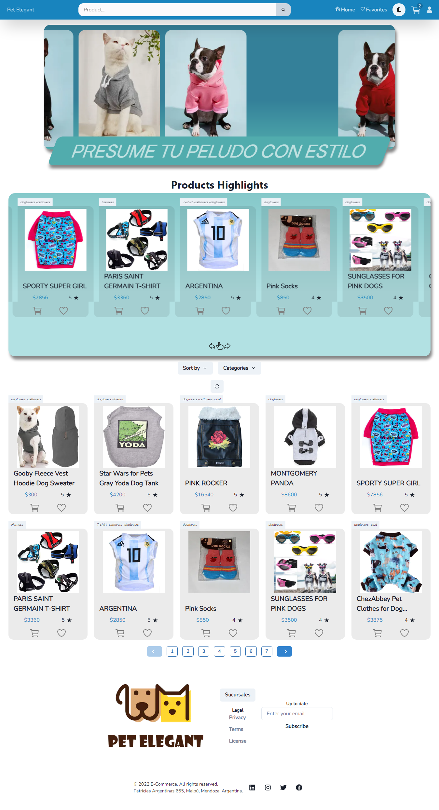

# Pet Elegant E-Commerce

Trabajo Academico en Henry Bootcamp

El sitio web de Pet Elegant es una Single Page Application (SPA). Tiene un diseño compacto y limpio, es rapidísimo y fácilmente navegable. Dado que su grupo objetivo son personas con amor hacia sus mascotas, que quisieran poner en el centro y como protagonistas a sus perros y gatos, con el cuidado y respeto que ellos se merecen. Por eso, el sitio web busca la satisfacción tanto del Pet Lover como de la mascota.

## Demo

This is link to demo
https://petelegant.vercel.app

## Authors

- [@Matias Palomo](https://www.github.com/Matiaspp96)
- [@Virginia Camuerga](https://www.github.com/K4rmu)
- [@Cristian Fernandez](https://www.github.com/cristiannok)
- [@Sebastian Contini](https://www.github.com/sebagdm)
- [@Arkangel Contreras](https://www.github.com/arkangel3d)
- [@Ricardo Bravo](https://www.github.com/RicardoBravo92)

## Screenshots

## Tech Stack

**Client:** Next.js, Redux, ChakraUI, Framer Motion, next-redux-wrapped, React-Icons, React-Fonts

**Server:** Node, Express, Passport, JWT, Nodemailer, Mongoose

**DataBase:** MongoDB 

**Deploy:** Vercel, Heroku CLI

## Features

- Light/dark mode
- Pasarela de pago
- Responsive
- CRUD de productos
- Gestión de ordenes y usuarios
- Ingreso con Google o registro de usuarios
- Emails de transacciones
- Catálogo y detalle de productos
- Sección /Favoritos, /MyAccount, /Orders para usuarios

## Feedback

If you have any feedback, please reach out to us at matiaas.p@gmail.com

